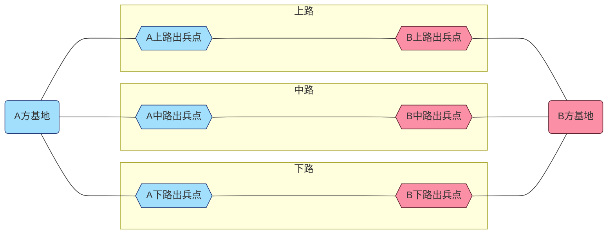
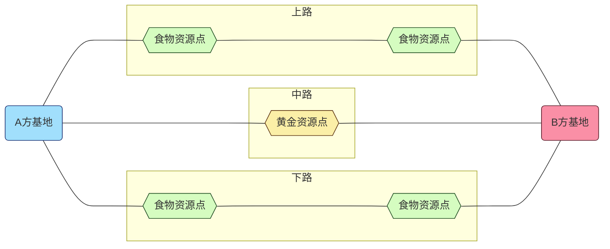

@import "my-style.less"
***
[TOC]
***

# 基本设计

## 基本名词

### 对局

在游戏中进行的单次比赛称为对局。每次对局由两方参与，双方从相同或近似的初始状态开始，以一方的失败作为结束。  
对局之间互不影响，后面发生的对局不会继承前面对局的结果。

!!! example 示例
    对局中，若双方选择了同样的文明进行对局，则对局开始时，双方应当处于完全一致的数值水平。

### 战场

对局开展的场景称为战场。
  

### 玩家

对局的参与者被称为玩家，玩家是对局内所有决策、交互的操作者。

### 单位

战场中可存在、可被销毁、且具有一定主动或被动行为逻辑的物体被称为单位。

!!! example 示例
    战场上玩家派出的士兵、建造的建筑都属于单位。

### HP

*Hit Points*。用于指示单位在被销毁前还能承受的损失。俗称**血量、体力值、生命值**。  
当单位HP小于等于0时，单位将被摧毁。

### 基地

对局中玩家储备人力、物资，调遣单位，进而推动各式攻守策略的区块。

同时，基地也作为一个单位，用于指示玩家的损失情况。当基地HP小于等于0时，基地将被摧毁，即该方玩家失败。

### 路

战场上不同的进攻路线称为路。路的两端分别是两方玩家的基地，根据方位不同被分为**上路、中路和下路**。  
对于一方的单位而言，路的起点是该路的本方出兵点，终点是对方基地。

**三条路仅仅在基地处相连接，但对双方单位而言仅终点互通**

!!! warning 注意
    所谓“**对双方单位而言仅终点互通**”，意思是对于某一方单位而言，其只能由出兵点向前，而无法后退绕道至其他路行进，因此当且仅当他们行进至终点时，他们才能相遇。

## 游戏目标

双方玩家在保证本方基地HP大于0的前提下，将对方基地的HP削减至0。

## 游戏流程

玩家需要采集资源，并利用手头上的资源进行购买单位、升级科技、购买建筑等一系列决策行为，最终击败对手。

## 游戏背景

游戏以玩具为表现形式。

游戏的文案设计基本遵循公元9世纪~16世纪的历史。

***

# 游戏机制

## 文明

**文明**即具有不同特色的一系列数值及机制配置。  

玩家可以在对局前选择想要在对局中使用的文明，在对局开始后，即可以使用这一文明的各种特性即相关机制。**在对局开始后，玩家不能改变其使用的文明**。

!!! example 示例
    假设A玩家选择文明的特性是“HP+50%”，B玩家选择文明的特性是“初始资源+50%”，那么进入对局时，A玩家将拥有比B玩家多50%的初始HP，而B玩家将拥有比A玩家多50%的初始资源。

可选文明表~暂定~：
| 文明   | 关键词                                                                      |
| :------: | --------------------------------------------------------------------------- |
| 中国   | 科技~科技研发加成~、农业~食物生产加成~   |
| 西班牙 | 征服~进攻加成~、宗教~宗教单位加成~       |
| 法兰西 | 改革~政策系统加成~、骑士~重骑兵单位加成~ |
| 蒙古   | 游牧~建筑可转移~、骑射~弓骑兵加成~       |
| 拜占庭 | 传承~可奇观胜利~、防御~防守加成~       |
| 阿拉伯帝国 | 传教~可招降士兵单位~、贸易~落后时可获得加成~      |

## 资源

资源是玩家购买单位、研发科技、建造建筑时需要消耗的成本。

资源分为**食物**和**黄金**。

### 资源采集 {ignore=true}

采集资源的单位称为**工人**，可供资源采集的地点称为**资源点**，工人将采集得来的资源上交称为**卸货**。

!!! tip 提示
    工人的工作流程包括**前往资源点、采集资源、返回卸货点、卸货**。

玩家需要派遣**工人**采集资源，资源只能在**资源点**进行采集，只有工人在**卸货点**卸货之后玩家才能获得这些资源。

!!! tip 提示
    出兵点是默认的卸货点。

## 单位

### 预备役 {ignore=true}

### 生产 {ignore=true}

### 购买 {ignore=true}

### 战斗 {ignore=true}

### 补给 {ignore=true}

## 生产力

## 科技

## 政策

## 建筑
