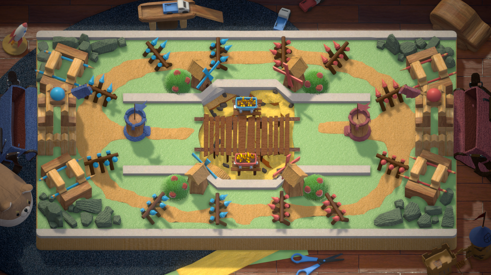
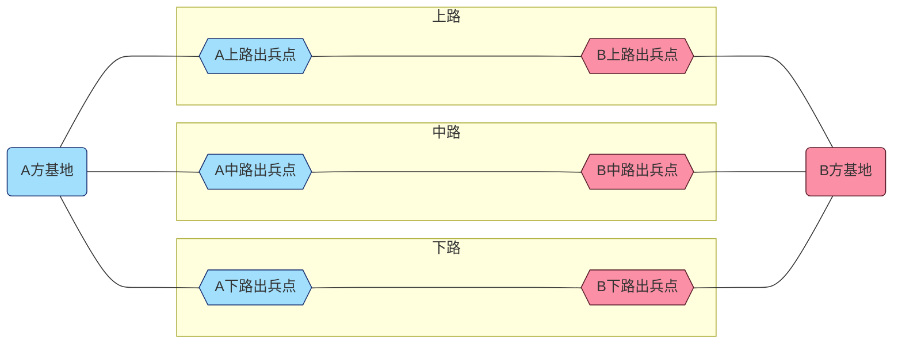
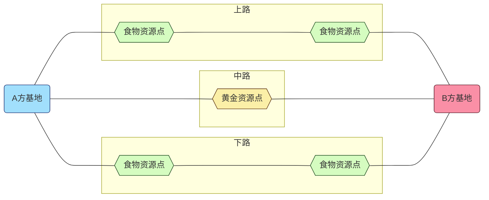

@import "my-style.less"
***
[TOC]
***

# 基本设计

## 基本名词

### 对局

在游戏中进行的单次比赛称为对局。每次对局由两方参与，双方从相同或近似的初始状态开始，以一方的失败作为结束。  
对局之间互不影响，后面发生的对局不会继承前面对局的结果。

!!! example 示例
    对局中，若双方选择了同样的文明进行对局，则对局开始时，双方应当处于完全一致的数值水平。

### 战场

对局开展的场景称为战场。
  


### 玩家

对局的参与者被称为玩家，玩家是对局内所有决策、交互的操作者。

### 单位

战场中可存在、可被销毁、且具有一定主动或被动行为逻辑的物体被称为单位。

!!! example 示例
    战场上玩家派出的士兵、建造的建筑都属于单位。

### HP

*Hit Points*。用于指示单位在被销毁前还能承受的损失。俗称**血量、体力值、生命值**。  
当单位HP小于等于0时，单位将被摧毁。

### 基地

对局中玩家储备人力、物资，调遣单位，进而推动各式攻守策略的区块。

同时，基地也作为一个单位，用于指示玩家的损失情况。当基地HP小于等于0时，基地将被摧毁，即该方玩家失败。

### 路

战场上不同的进攻路线称为路。路的两端分别是两方玩家的基地，根据方位不同被分为**上路、中路和下路**。  
对于一方的单位而言，路的起点是该路的本方出兵点，终点是对方基地。



**三条路仅仅在基地处相连接，但对双方单位而言仅终点互通**

!!! warning 注意
    所谓“**对双方单位而言仅终点互通**”，意思是对于某一方单位而言，其只能由出兵点向前，而无法后退绕道至其他路行进，因此当且仅当他们行进至终点时，他们才能相遇。


### 调遣

将单位指派到战场中某个特定点位或区域上（譬如路）的过程称为调遣。调遣后的单位可称为**场上的单位**。

## 游戏目标

双方玩家在保证本方基地HP大于0的前提下，将对方基地的HP削减至0。

## 游戏流程

玩家需要采集资源，并利用手头上的资源进行购买单位、升级科技、购买建筑等一系列决策行为，最终击败对手。

## 游戏背景

游戏以玩具为表现形式。

游戏的文案设计基本遵循公元9世纪~16世纪的历史。

***

# 游戏机制

## 文明

**文明**即具有不同特色的一系列数值及机制配置。  

玩家可以在对局前选择想要在对局中使用的文明，在对局开始后，即可以使用这一文明的各种特性即相关机制。**在对局开始后，玩家不能改变其使用的文明**。

!!! example 示例
    假设A玩家选择文明的特性是“HP+50%”，B玩家选择文明的特性是“初始资源+50%”，那么进入对局时，A玩家将拥有比B玩家多50%的初始HP，而B玩家将拥有比A玩家多50%的初始资源。

可选文明表~暂定~：
|    文明    | 关键词                                                                                                             |
| :--------: | ------------------------------------------------------------------------------------------------------------------ |
|    中国    | **<span style="color:#4EC5F1">科技</span>**~科技研发加成~、**<span style="color:#4EC5F1">农业</span>**~食物生产加成~       |
|   神圣罗马帝国   | **<span style="color:#4EC5F1">选帝侯</span>**~政策系统加成~、**<span style="color:#4EC5F1">骑士</span>**~重骑兵单位加成~     |
|    蒙古    | **<span style="color:#4EC5F1">游牧</span>**~可转移建筑~、**<span style="color:#4EC5F1">骑射</span>**~弓骑兵加成~           |
|   拜占庭   | **<span style="color:#4EC5F1">传承</span>**~可奇观胜利~、**<span style="color:#4EC5F1">防御</span>**~防守加成~             |
| 阿拉伯帝国 | **<span style="color:#4EC5F1">宗教</span>**~宗教单位加成~、**<span style="color:#4EC5F1">贸易</span>**~落后时可获得加成~ |
|   奥斯曼帝国   | **<span style="color:#4EC5F1">征服</span>**~进攻加成~、**<span style="color:#4EC5F1">扩张</span>**~建造加成~           |

## 资源

资源是玩家购买单位、研发科技、建造建筑时需要消耗的成本。

资源分为**食物**和**黄金**。两种资源相互资源可兑换，汇率为5食物：1黄金。

### 资源采集 {ignore=true}

采集资源的单位称为**工人**，可供资源采集的地点称为**资源点**，工人将采集得来的资源上交称为**卸货**。

玩家需要派遣**工人**采集资源，资源只能在**资源点**进行采集，只有工人在**卸货点**卸货之后玩家才能获得这些资源。


!!! tip 提示
    出兵点是默认的卸货点。



### 工人 {ignore=true}

工人是一种**单位**，其不具备攻击能力。  
工人的工作流程包括**前往资源点、采集资源、返回卸货点、卸货**。工人每次只能携带一定数量的资源往返，这个值称为**运载上限**。  
工人需要经过一定时间的生产才能调遣，生产完成后，玩家将获得一个**空闲工人**。当工人总数大等于玩家的工人人口上限时，工人即停止生产，直到工人总数小于工人人口上限。  
玩家只能调遣空闲工人，调遣后空闲工人将变为**工作工人**。每调遣一位空闲工人，空闲工人数量将-1。玩家可以将正在工作的工人召回后，空闲工人数量将+1。  
$$N_{工人总数}=N_{空闲工人数量}+N_{工作工人数量}$$

!!! example 示例
    若玩家当前的工人人口上限是10，后台将自动持续生产工人。假设已生产5位工人，而玩家未进行任何工人调遣操作，则玩家将拥有5个空闲工人。此时玩家可以对这5个空闲工人进行调遣，直到空闲人口数量为0。
    若已生产10位工人，则后台将暂停生产工人，直到玩家的工人人口上限增长或既有工人死亡， 工人生产才将继续。

!!! tip 提示
    - 工人若在卸货前死亡，玩家将得不到其身上携带的资源。
    - 工人采集资源和卸货都需要花费时间。

### 资源用途 {ignore=true}

食物消费的定位为**维护性支出**，包括：士兵补给、建筑维修等。  
黄金消费的定位为**增益性支出**，包括：单位购买、科技研发等。

## 士兵

士兵指战场上需要使用资源购买、可自主移动的单位。  
士兵的种类分为：
- 步兵系士兵
- 弓弩系士兵
- 骑兵系士兵
- 火药系士兵
- 攻城武器系士兵

### 生产与购买 {ignore=true}

士兵需要生产后才能被派遣。生产士兵不需要消耗资源，玩家购买士兵并进行调遣才需要花费资源。  
士兵生产后完毕后，该种士兵的**预备役数量**将+1。只有某种士兵**预备役数量**不为0，玩家才能购买之并进行调遣。当**预备役数量**大于或等于该种士兵**预备役上限**时，该种士兵的生产暂停。  
玩家购买士兵并进行调遣后，**预备役数量**将减去玩家的购买量。

!!! example 示例
    假设有士兵A购买成本是3金，生产时间为5s，预备役上限为5。那么游戏开始后，后台将每5s生产一个兵种A。若玩家不进行任何相关操作，25s后，玩家将拥有5个预备役士兵A，达到预备役数量上限，A的生产暂停。此后，若玩家需要在上路派遣3个士兵A，则需要花费$3\times 3=9$金；派遣后，A的预备役数量为2，小于预备役数量上限，生产重启。

!!! tip 提示
    - 只要预备役数量不达到上限，尽管资源已耗尽士兵也会持续生产。
    - 预备役士兵会提供生产力，而上场的士兵不能。
    - 玩家需要合理安排出兵时间，实现出兵利益最大化。

### 调遣 {ignore=true}

士兵只能在本方出兵点出发，沿着当前路一直走到尽头（即对方基地）。**游戏不存在士兵微操，玩家不能对单个士兵发起任何指令**。

### 战斗 {ignore=true}

士兵的战斗行为是自动的。包括移动、寻敌、攻击等。

### 补给 {ignore=true}

场上的士兵每隔一段时间需要消耗一定量的食物。

## 生产力

生产力是玩家生产速度、建造速度、研发速度等的加权值。  
生产力越高，玩家的士兵/工人生产、建筑建造、科技研发的速度就就快。  
在默认情况下，生产力的计算公式为：$$P=\sum ^{n_{s}}_{i}n_{i}p_{i}+n_wp_w$$  
其中，$n_{s}$为玩家可派遣士兵的种类，$n_{i}$为第$i$种士兵的预备役数量，$p_{i}$为单个第$i$种士兵可提供的生产力；，$n_{w}$为玩家空闲工人数量，$p_{i}$为玩家单个工人可提供的生产力。

!!! example 示例
    若玩家有3个空闲工人，每个工人提供5点生产力；同时玩家可以派遣士兵种类有A和B，且士兵A的预备役数量为5，士兵B的预备役数量为2，一个A能提供1点生产力，一个B能提供2点生产力。则玩家的生产力为$P=3\times 5+5\times 1+2\times 2=24$。


## 科技

科技是玩家在对局中可以进行的永久性升级。  
取得新科技需要等待一定的时间，这个过程称为**研发科技**，等待的时间称为**研发时间**，已经过研发时间与研发时间的比值称为**研发进度**。  
科技的研发过程不消耗任何资源，玩家购买该科技时才需要花费资源。不过，**即便研发进度未达到100%，玩家依然可以购买该科技，** 只不过需要耗费更多的资源。

科技被购买后，所能提供的加成才能生效，而科技一旦生效，其就将在剩下的对局中一直生效，无法解除。

### 科技树 {ignore=true}

众多科技组成了**科技树**。科技树是玩家研发科技的交互对象，对于科技A，玩家必须先取得该科技的所有前置科技，才能研发该科技。

!!! note 基本科技树
    ``` dot{style="zoom:0.7"}
    digraph G {
	rankdir=LR ranksep=1
	"手推车" [label="0016.手推车|{<f0>20秒| <f1>[10, 20] 黄金 }|提高工人速度\l减少卸货时间\l" fillcolor="#ffaa00" fontname=SimSun shape=record style=filled]
	"水利" [label="0017.水利|{<f0>20秒| <f1>[10, 20] 黄金 }|提高食物采集量\l降低食物采集时间\l" fillcolor="#ffaa00" fontname=SimSun shape=record style=filled]
	"手推车":e -> "水利":w [len=2.00]
	"采矿" [label="0019.采矿|{<f0>10秒| <f1>[10, 20] 黄金 }|提高矿物采集量\l降低矿物采集时间\l" fillcolor="#ffaa00" fontname=SimSun shape=record style=filled]
	"手推车":e -> "采矿":w [len=2.00]
	"行政机构" [label="0018.行政机构|{<f0>10秒| <f1>[10, 20] 黄金 }|提高工人人口上限\l提高工人生产速度\l\+\>【仓库】\l" fillcolor="#ffaa00" fontname=SimSun shape=record style=filled]
	"手推车":e -> "行政机构":w [len=2.00]
	"农学" [label="0020.农学|{<f0>10秒| <f1>[10, 20] 黄金 }|提高食物采集量\l\+\>【农庄】\l" fillcolor="#ffaa00" fontname=SimSun shape=record style=filled]
	"水利":e -> "农学":w [len=2.00]
	"行政机构":e -> "农学":w [len=2.00]
	"历法" [label="0023.历法|{<f0>10秒| <f1>[10, 20] 黄金 }|提高食物采集量\l" fillcolor="#ffaa00" fontname=SimSun shape=record style=filled]
	"农学":e -> "历法":w [len=2.00]
	"矿井勘探" [label="0022.矿井勘探|{<f0>10秒| <f1>[10, 20] 黄金 }|提高矿物采集量\l\+\>【矿场】\l" fillcolor="#ffaa00" fontname=SimSun shape=record style=filled]
	"采矿":e -> "矿井勘探":w [len=2.00]
	"行政机构":e -> "矿井勘探":w [len=2.00]
	"化学" [label="0025.化学|{<f0>10秒| <f1>[10, 20] 黄金 }|提高矿物采集量\l" fillcolor="#ffaa00" fontname=SimSun shape=record style=filled]
	"矿井勘探":e -> "化学":w [len=2.00]
	"教育" [label="0021.教育|{<f0>10秒| <f1>[10, 20] 黄金 }|提高科研速度\l提高单位生产力\l提高工人人口上限\l提高军事人口上限\l解锁8【学院】。\l" fillcolor="#ffaa00" fontname=SimSun shape=record style=filled]
	"行政机构":e -> "教育":w [len=2.00]
	"经济" [label="0024.经济|{<f0>10秒| <f1>[10, 20] 黄金 }|提高工人人口上限\l提高军事人口上限\l提高单位生产力\l\+\>【市场】\l" fillcolor="#ffaa00" fontname=SimSun shape=record style=filled]
	"教育":e -> "经济":w [len=2.00]
	"工程技术" [label="0026.工程技术|{<f0>10秒| <f1>[10, 20] 黄金 }|提高建筑速度\l提高单位生产力\l提高工人人口上限\l提高军事人口上限\l" fillcolor="#ffaa00" fontname=SimSun shape=record style=filled]
	"经济":e -> "工程技术":w [len=2.00]
	"交通运输" [label="0027.交通运输|{<f0>10秒| <f1>[10, 20] 黄金 }|提高工人人口上限\l提高军事人口上限\l提高单位生产力\l\+\>【补给站】\l" fillcolor="#ffaa00" fontname=SimSun shape=record style=filled]
	"经济":e -> "交通运输":w [len=2.00]
	"军事训练" [label="0005.军事训练|{<f0>20秒| <f1>[10, 20] 黄金 }|\X\>【民兵】\l\+\>【刀剑手】\l" fillcolor="#228dff" fontname=SimSun shape=record style=filled]
	"战术" [label="0006.战术|{<f0>20秒| <f1>[10, 20] 黄金 }|\+\>【弓箭手】\l" fillcolor="#228dff" fontname=SimSun shape=record style=filled]
	"军事训练":e -> "战术":w [len=2.00]
	"马镫" [label="0008.马镫|{<f0>20秒| <f1>[10, 20] 黄金 }|\+\>【骑兵】\l" fillcolor="#228dff" fontname=SimSun shape=record style=filled]
	"战术":e -> "马镫":w [len=2.00]
	"军事工程" [label="0010.军事工程|{<f0>30秒| <f1>[10, 20] 黄金 }|\+\>【拒马】\l" fillcolor="#228dff" fontname=SimSun shape=record style=filled]
	"马镫":e -> "军事工程":w [len=2.00]
	"攻城器械" [label="0012.攻城器械|{<f0>30秒| <f1>[10, 20] 黄金 }|\+\>【冲车】\l" fillcolor="#228dff" fontname=SimSun shape=record style=filled]
	"军事工程":e -> "攻城器械":w [len=2.00]
	"火药" [label="0013.火药|{<f0>20秒| <f1>[10, 20] 黄金 }|\+\>【火枪手】\l" fillcolor="#228dff" fontname=SimSun shape=record style=filled]
	"攻城器械":e -> "火药":w [len=2.00]
	"火炮" [label="0015.火炮|{<f0>20秒| <f1>[10, 20] 黄金 }|\+\>【火炮】\l" fillcolor="#228dff" fontname=SimSun shape=record style=filled]
	"火药":e -> "火炮":w [len=2.00]
	"常备军" [label="0007.常备军|{<f0>30秒| <f1>[10, 20] 黄金 }|提高步兵攻击力\l提高步兵防御力\l\+\>【兵营】\l" fillcolor="#228dff" fontname=SimSun shape=record style=filled]
	"军事训练":e -> "常备军":w [len=2.00]
	"复合弓" [label="0009.复合弓|{<f0>30秒| <f1>[10, 20] 黄金 }|提高远程单位攻击力\l提高射击距离\l\+\>【靶场】\l\+\>【驻防点】\l" fillcolor="#228dff" fontname=SimSun shape=record style=filled]
	"战术":e -> "复合弓":w [len=2.00]
	"马匹育种" [label="0011.马匹育种|{<f0>30秒| <f1>[10, 20] 黄金 }|提高骑兵速度\l降低骑兵价格\l\+\>【马厩】\l" fillcolor="#228dff" fontname=SimSun shape=record style=filled]
	"马镫":e -> "马匹育种":w [len=2.00]
	"军事技术" [label="0014.军事技术|{<f0>30秒| <f1>[10, 20] 黄金 }|提高攻城器械生产速度\l降低攻城器械价格\l\+\>【兵工厂】\l" fillcolor="#228dff" fontname=SimSun shape=record style=filled]
	"攻城器械":e -> "军事技术":w [len=2.00]
	"手工业" [label="0000.手工业|{<f0>30秒| <f1>[10, 20] 黄金 }|提高攻击力\l提高防御力\l\+\>【铁匠铺】\l" fillcolor="#65d84b" fontname=SimSun shape=record style=filled]
	"铸造" [label="0001.铸造|{<f0>30秒| <f1>[10, 20] 黄金 }|提高攻击力\l提高攻击速度\l" fillcolor="#65d84b" fontname=SimSun shape=record style=filled]
	"手工业":e -> "铸造":w [len=2.00]
	"冶金" [label="0002.冶金|{<f0>30秒| <f1>[10, 20] 黄金 }|提高攻击力\l" fillcolor="#65d84b" fontname=SimSun shape=record style=filled]
	"铸造":e -> "冶金":w [len=2.00]
	"锁子甲" [label="0003.锁子甲|{<f0>30秒| <f1>[10, 20] 黄金 }|提高防御力\l提高速度\l" fillcolor="#65d84b" fontname=SimSun shape=record style=filled]
	"手工业":e -> "锁子甲":w [len=2.00]
	"板甲" [label="0004.板甲|{<f0>30秒| <f1>[10, 20] 黄金 }|提高防御力\l" fillcolor="#65d84b" fontname=SimSun shape=record style=filled]
	"锁子甲":e -> "板甲":w [len=2.00]
    }

    ```

## 政策

政策是玩家在对局中可自主启用、自主弃用的增益效果。  
当玩家启用政策时，政策对应的增益效果将立即生效；当玩家弃用政策时，其增益效果将立即消失。
政策可以反复启用与弃用。
玩家只能从已解锁的政策中启用政策，只能从已启用的政策中弃用政策，弃用政策后玩家并不会失去它，也就是说玩家可以等到下次需要时再次启用它。

!!! example 示例
    假设有政策A的效果为【步兵生产速度+100%】，若玩家启用该政策，则在之后的对局中，玩家所有步兵系士兵的生产速度都+100%。若玩家弃用该政策，玩家生产步兵系士兵的速度将-100%，即恢复为正常水平。

### 启用与弃用政策 {ignore=true}

玩家能够启用的政策数量受到**政策槽位**的制约。玩家可以在政策面板中启用政策，而不同的政策占用不同的槽位数量。玩家启用政策的占用槽位之和必须小于等于玩家的政策槽位数量。

尽管政策能够反复使用，但每次启用/弃用政策都会使得政策进入冷却阶段，即需要等待一段时间后才能再次起用/弃用该政策，不过启用/弃用其他政策不受影响。

!!! example 示例
    假设有政策A的冷却时间为5s，若玩家启用该政策，则接下来的5s内，玩家不能弃用该政策。若玩家弃用该政策，则接下来的5s内，玩家不能启用该政策。但在此期间政策B、C依然可以正常启用/弃用。

### 解锁政策 {ignore=true}

政策需要玩家达成某些条件才能解锁，而一旦解锁玩家将在之后的对局中一直拥有该政策的使用权。

!!! example 示例
    假设有政策A的解锁条件是【用弓弩系士兵击杀5个士兵】，则在达成这个条件之前，玩家都无法使用政策A。达成该条件后，玩家将可以在政策面板起用该政策。

## 建筑

建筑是场上不可移动的，能带来特殊效果的单位。建筑需要耗费资源购买，并在购买后等待一定时间才能生效，称为**修建建筑**，完成的状态称为**建成建筑**。

建筑必须修建在建筑槽位上，一个建筑槽位上只能修建一个建筑。建筑槽位的位置由战场决定，玩家无法移动。建筑必须建成后才能带来特殊效果。

玩家可以同时拥有多个同种建筑（如同时拥有2个住房），这些建筑的效果将得到叠加。

### 建筑建造 {ignore=true}

地图的三条路上有多个建筑槽位，在游戏开始时均为空闲状态。  
玩家可以在空闲的建筑槽位建造建筑，确定进行建造后建筑槽位将由空闲状态转为占用状态。建造建筑需要花费一定的黄金并等待一定的时间，这段过程称为**建造过程**，建筑必须在建成后才能起效。

建筑拥有防御力与HP，一旦HP归零视为建筑被摧毁，其能提供的所有效果将全部消失，建筑槽位将回归空闲状态。  
通过**修理**可以将建筑的HP回满。  

玩家可以主动**拆除**建筑，这样将可以将占用的建筑槽位空出，视为建筑被摧毁。拆除过程是瞬间的。

!!! warning 注意
    - 升级建筑无法将建筑的HP回满，但是若升级会提高建筑的HP上限，则建筑的当前HP也会按照比例提高。
    - 当玩家开始建造建筑时，建筑的HP即为满格建造过程中的建筑可以被摧毁。

!!! tip 提示
    游戏的不同时期需要的建筑也许会有不同，因此玩家可能需要根据战场形势主动拆除建筑。   

### 建筑修理 {ignore=true}

当建筑的HP不为满格时，玩家使建筑进入修复状态。  
在建筑进入修复状态时，其每过$s_{i}$时间，就会增长$h_{i}$点HP，同时耗费$c_{i}$点**食物**。其中，$h_{i}$与生产力有关。  
建筑HP回满时，建筑自动退出修复状态，玩家也可以手动选择退出修复状态。

!!! warning 注意
    若建筑在修复时玩家食物耗尽，建筑将不会回复HP，但其仍然将保持修复状态；这种“停滞”的修复状态直到食物重新满足需求才能恢复正常。

### 建筑升级 {ignore=true}

一个建筑可以向多个方向升级，不同方向的升级可以共存。

建筑一旦被建成，即为其所有升级方向的**LV.1**。下文图表中**LV.1**的造价即为建筑的建造造价。*也就是说，对于同一建筑，其所有升级方向的LV.1的造价都相同*。

!!! example 示例
    如玩家在升级住房时可以选择向**工人人口**升级或**军事人口**升级，每次只能向一个方向升一级，消耗的资源和时间为目标等级的对应花销。
    两个方向的升级可以共存，如住房可以同时为**LV.2 工人人口** + **LV.3 军事人口**。

